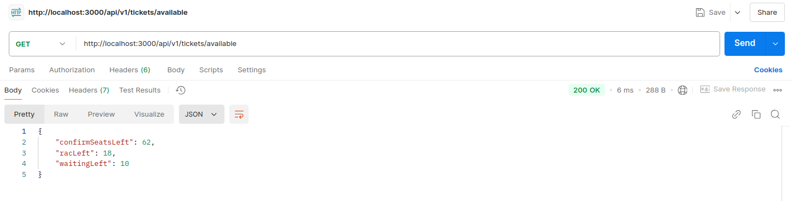

# Railway Reservation API

## Table of Contents
- [1. Architecture Overview and Setup](#1-architecture-overview)  
  - [1.1 System Components](#11-system-components)
  - [1.2 Docker Config](#12-docker-config)
  - [1.3 How to run?](#13-setup)
- [2. Database Model Diagram](#2-database-model-diagram)  
- [3. Flowcharts](#3-flowcharts)  
  - [3.1 Ticket Booking Flow](#31-ticket-booking-flow)  
  - [3.2 Ticket Cancellation Flow](#32-ticket-cancellation-flow)  
- [4. Sample API Requests and Responses](#4-sample-api-requests-and-responses)  
  - [4.1 Book Ticket](#41-book-ticket)  
  - [4.2 Cancel Ticket](#42-cancel-ticket)  
  - [4.3 List Booked Tickets](#43-list-booked-tickets)  
  - [4.4 List Available Categories](#44-list-available-categories)  
- [5. Additional Notes](#5-additional-notes)  

---

## 1. Architecture Overview

### 1.1 System Components


- **Client**: Makes HTTP API calls for booking, canceling, and listing tickets.  
- **API Server**: Express.js-based REST API server. Handles requests, business logic, DB transactions, concurrency controls.  
- **PostgreSQL**: Stores passengers, tickets, berth allocations data.

### 1.2 Docker Config

- Two containers:  
  - `db`: PostgreSQL (initialized with schema + seed scripts)  
  - `api`: Node.js app connecting to DB over Docker network  

### 1.3 Setup
```plaintext
Execute the following docker command from project root directory:  docker-compose up --build
- This will make init_db.sql file to execute the sql commands to create tables for a new environment
- Wait for server to start with a log :::: Server running on port 3000
```
---

## 2. Database Model Diagram

```plaintext
passengers: stores personal details

tickets: tracks ticket status (CONFIRMED, RAC, WAITING, CANCELLED) and link to passenger

berth_allocations: berth type for confirmed/RAC tickets
```
## 3. Flowcharts

### 3.1 Ticket Booking Flow


### 3.2 Ticket Cancellation Flow


## 4. Sample API Requests and Responses
### Please use the `curl` provided for each api

### 4.1 Book ticket
- The response is returning the ticket id as well as the status of ticket i.e, CONFIRMED/RAC/WAITING
- The `hasChild` field in request body is optional 

- There are sample payloads commented out for this request, below is the curl that can be copied to execute the api.
```plaintext
    curl --location 'http://localhost:3000/api/v1/tickets/book' \
    --header 'Content-Type: application/json' \
    --data '{
        "name": "Alice Smith",
        "age": 30,
        "gender": "female",
        "hasChild": true
    }
```
### 4.2 Cancel ticket

- We pass the ticket_id in query params, The ticket will be cancelled and will update the tickets data dynamically to promote the RAC or WAITING ticket
```plaintext
    curl --location --request PUT 'http://localhost:3000/api/v1/tickets/cancel/4'
```
### 4.3 List booked tickets

- We get the list of tickets that are booked and are active, any cancelled ticket won't be included in the response
```plaintext
    curl --location 'http://localhost:3000/api/v1/tickets/booked'
```
### 4.4 List available categories

- We will be getting the available seats in response, category wise
```plaintext
curl --location 'http://localhost:3000/api/v1/tickets/available'
```
## 5. Additional Notes
- Concurrency: All booking/cancellation transactions lock rows/tables as needed to prevent race conditions.
- Berth Preferences: 
- - Seniors (age >= 60) and females with children get LOWER berth preference.
- - RAC ticket passengers get SIDE LOWER BERTH.
- Age < 5: Booked as confirmed but no seat allocated.
- Docker Compose: Start DB first, then API. Use connection retry logic in API to handle DB startup delay.
- Error Handling: Clear response messages on full booking or invalid cancellation.
- For testing purpose, the tickets total can be reduced to 10 tickets for each category by changing the values in constant.js file.